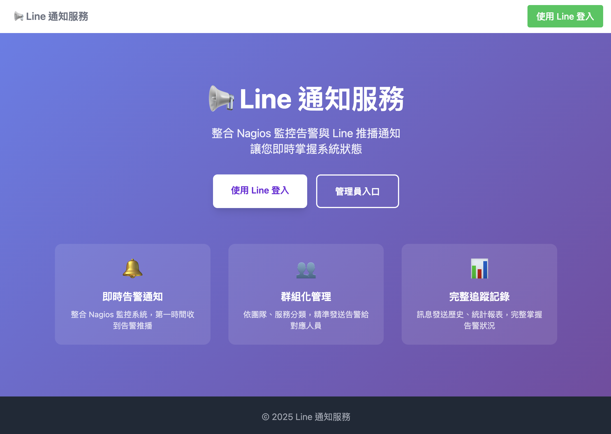
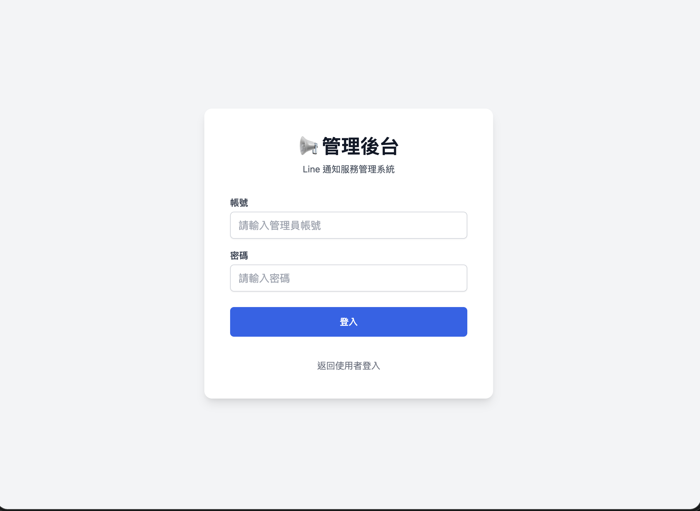
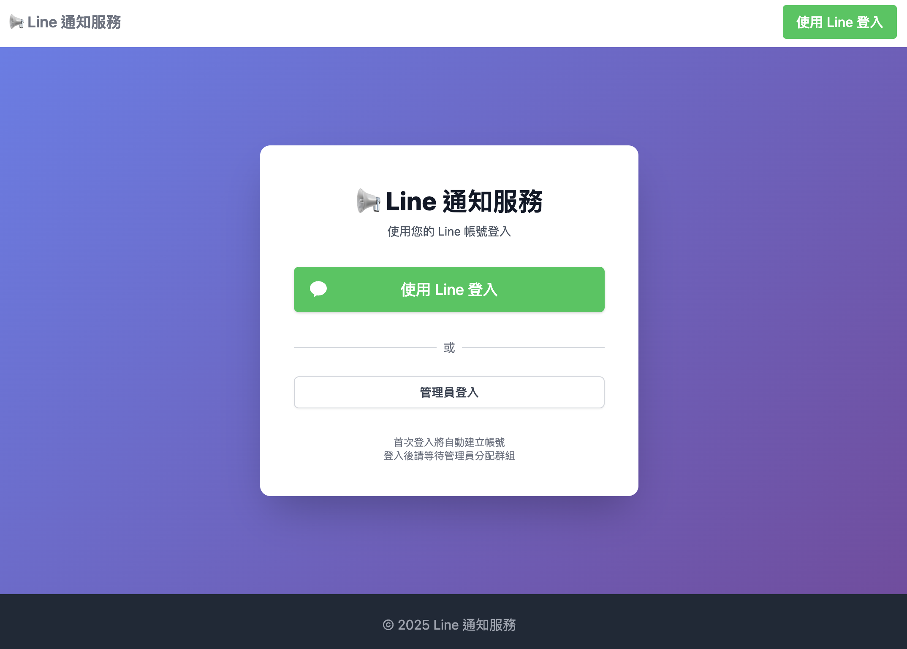
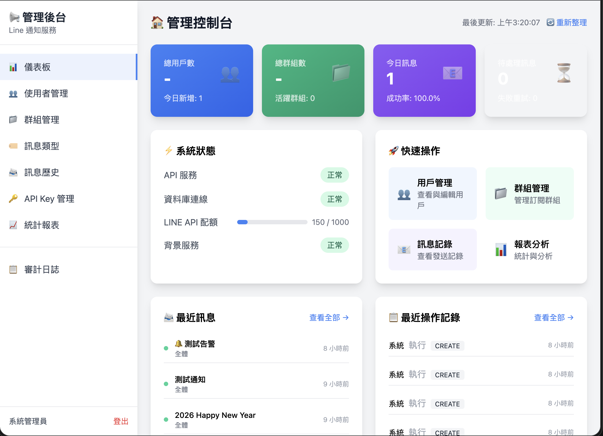
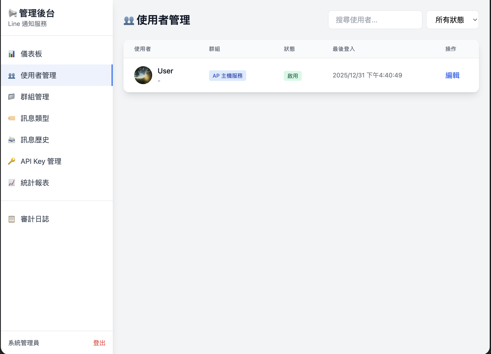
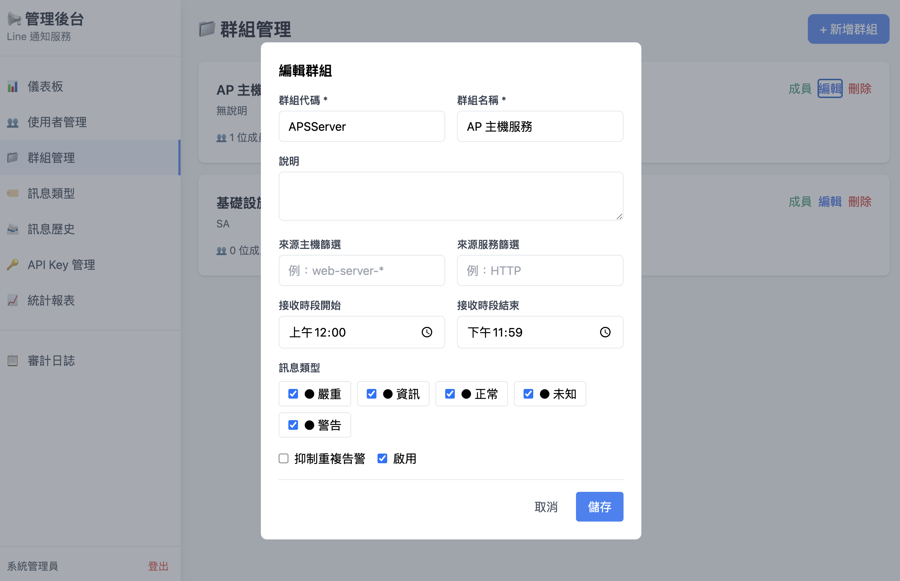
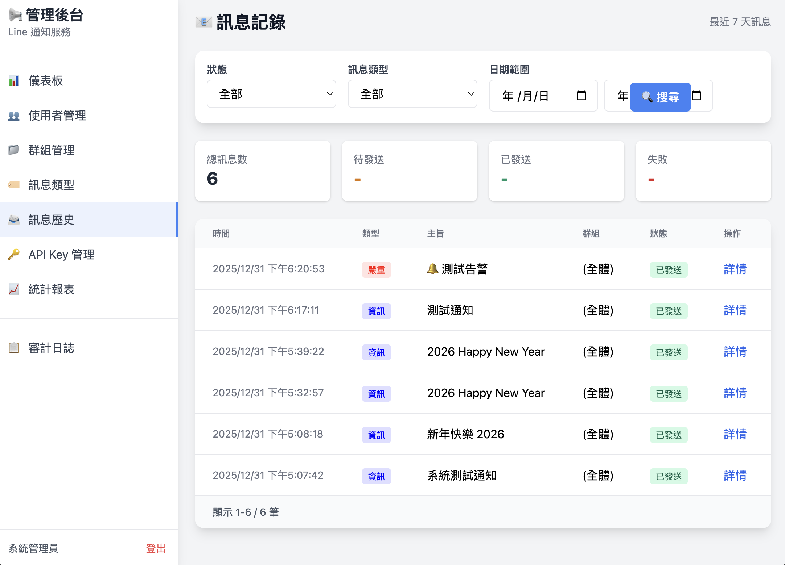
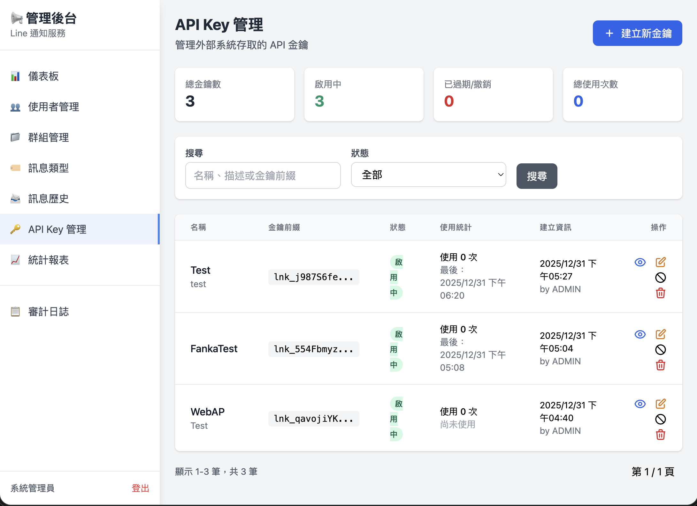
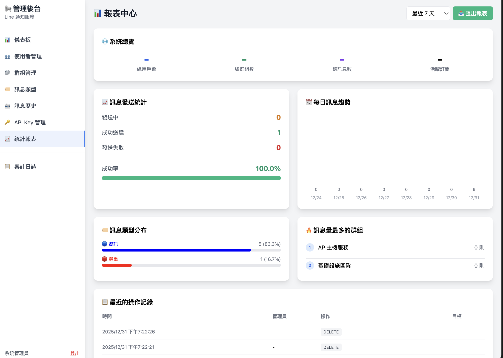
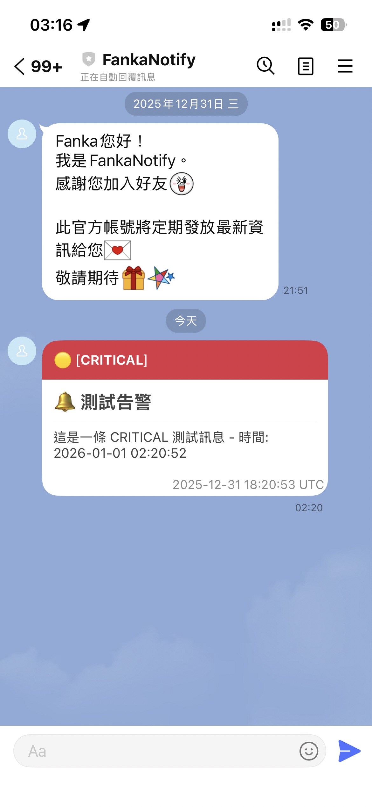

# Line Notification Service (LNS)

整合 Nagios 監控告警與 LINE 推播通知的服務系統，讓運維人員能即時透過 LINE 接收系統告警。

## ✨ 壹、功能特色

- 🔔 **即時告警通知** - 整合 Nagios 監控系統，第一時間推播告警
- 👥 **群組化管理** - 依團隊、服務分類，精準發送告警給對應人員
- 🔐 **LINE Login 整合** - 使用者透過 LINE 帳號登入，自動綁定通知
- 📊 **完整追蹤記錄** - 訊息發送歷史、統計報表，完整掌握告警狀況
- 🔑 **API Key 認證** - 支援外部系統透過 API Key 安全發送通知

## 🏗️ 貳、技術架構

- **後端框架**: ASP.NET Core 10.0
- **資料庫**: MySQL 8.0
- **認證機制**: JWT + LINE Login OAuth 2.0
- **容器化**: Docker / Podman

## 📁 叄、專案結構

```
NotifySystem/
├── src/
│   └── LineNotify.Api/          # 主要 API 專案
│       ├── Controllers/         # API 控制器
│       ├── Services/            # 業務邏輯服務
│       ├── Models/              # 資料模型
│       ├── Pages/               # Razor Pages (前端頁面)
│       └── Data/                # 資料庫相關
├── docker/                      # Docker 部署配置
├── docs/                        # 文件
│   ├── api-reference.md         # API 參考文件
│   ├── deployment.md            # 部署指南
│   └── nagios-integration.md    # Nagios 整合說明
└── specs/                       # 規格文件
```

## 🚀 肆、快速開始

### 一、前置需求

- [.NET 10 SDK](https://dotnet.microsoft.com/download)
- [Docker](https://www.docker.com/) 或 [Podman](https://podman.io/)
- [MySQL 8.0](https://www.mysql.com/) (或使用 Docker 容器)
- [LINE Developers 帳號](https://developers.line.biz/) （用於 LINE Login 及 Messaging API）

### 二、LINE 開發者設定

使用本服務前，需先在 LINE Developers Console 建立必要的 Channel：

1. **前往 [LINE Developers Console](https://developers.line.biz/console/)**

2. **建立 Provider**（如尚未建立）

3. **建立 LINE Login Channel**
   - 選擇「Create a LINE Login channel」
   - 填寫 Channel 名稱、描述
   - 設定 Callback URL（本地開發可先留空，稍後使用 ngrok 設定）
   - 記下 **Channel ID** 和 **Channel Secret**

4. **建立 Messaging API Channel**
   - 選擇「Create a Messaging API channel」
   - 填寫 Channel 名稱、描述
   - 在「Messaging API」標籤中，點擊「Issue」產生 **Channel Access Token**

> 💡 **提示**：LINE Login 和 Messaging API 需要分開建立兩個不同的 Channel。

### 三、本地開發

1. **複製專案**

    ```bash
    git clone https://github.com/fankachang/NotifySystem.git
    cd NotifySystem
    ```

2. **啟動 MySQL 容器**

    使用 Docker：
    ```bash
    cd docker
    docker-compose up -d mysql
    ```

    或使用 Podman：
    ```bash
    cd docker
    podman-compose up -d mysql
    ```

    > 💡 **Podman 使用者注意事項**：
    > - 請先安裝 `podman-compose`：`pip install podman-compose` 或 `brew install podman-compose`
    > - 若遇到網路問題，可先建立網路：`podman network create docker_default`

3. **配置環境**

    **方式一：使用 docker/.env（推薦）**

      ```bash
      cd docker
      cp .env.example .env
      # 編輯 .env 填入 LINE 相關配置
      ```

      > 💡 `docker-compose.yml` 已預設資料庫連線資訊，只需設定 LINE 相關參數即可。
      > 
      > 若搭配 ngrok 測試 LINE Login，請將 `LINE_CALLBACK_URL` 設為：
      > ```
      > LINE_CALLBACK_URL=https://your-ngrok-id.ngrok-free.app/api/v1/auth/line/callback
      > ```

    **方式二：使用 appsettings.Development.json**

      ```bash
      cd src/LineNotify.Api
      cp appsettings.Development.example.json appsettings.Development.json
      # 編輯 appsettings.Development.json 填入必要配置
      ```

4. **執行資料庫遷移**

    ```bash
    dotnet ef database update
    ```

5. **啟動服務**

    ```bash
    dotnet run --urls "http://0.0.0.0:5050"
    ```

6. **存取服務**

- 前端頁面: http://localhost:5050
- 管理後台: http://localhost:5050/Admin
- API 文件: http://localhost:5050/swagger

### 四、測試 LINE Login（使用 ngrok）

由於 LINE OAuth 需要公開的 HTTPS 網址，本地開發時需使用 ngrok：

1. **安裝 ngrok**

    ```bash
    # macOS
    brew install ngrok
    
    # Windows (Chocolatey)
    choco install ngrok
    ```

2. **設定 ngrok authtoken**
   
   前往 [ngrok 官網](https://ngrok.com/) 註冊並取得 authtoken：

    ```bash
    ngrok config add-authtoken YOUR_TOKEN
    ```

3. **啟動 ngrok 通道**

    ```bash
    ngrok http 5050
    ```

    ngrok 會顯示公開網址，例如：`https://abc123.ngrok-free.app`

4. **設定 LINE Callback URL**

   - 前往 [LINE Developers Console](https://developers.line.biz/console/)
   - 選擇您的 LINE Login Channel
   - 在「LINE Login」標籤中，設定 Callback URL：
     ```
     https://your-ngrok-url.ngrok-free.app/api/v1/auth/line/callback
     ```

5. **更新本地環境設定**

   編輯 `docker/.env`（或 `appsettings.Development.json`），填入 ngrok 網址：
   
    ```bash
    LINE_CHANNEL_ID=your_channel_id
    LINE_CHANNEL_SECRET=your_channel_secret
    LINE_CALLBACK_URL=https://your-ngrok-url.ngrok-free.app/api/v1/auth/line/callback
    LINE_MESSAGING_ACCESS_TOKEN=your_messaging_access_token
    ```

> ⚠️ **注意**：免費帳號每次啟動 ngrok 會產生新的隨機網址，需同步更新 LINE Console 的 Callback URL。

詳細說明請參考 [部署指南](docs/deployment.md#本地開發---使用-ngrok-測試-line-login)。

### 五、Docker / Podman 部署

使用 Docker：
```bash
cd docker
docker-compose -f docker-compose.prod.yml up -d --build
```

使用 Podman：
```bash
cd docker
podman-compose -f docker-compose.prod.yml up -d --build
```

## 📖 伍、文件

- [API 參考文件](docs/api-reference.md) - 完整的 API 端點說明
- [部署指南](docs/deployment.md) - 生產環境部署與 ngrok 設定
- [Nagios 整合](docs/nagios-integration.md) - 與 Nagios 監控系統整合

## 🔧陸、API 端點概覽

### 一、認證 API
| 方法 | 路徑 | 說明 |
|------|------|------|
| GET | `/api/v1/auth/line/login` | 取得 LINE Login 授權 URL |
| GET | `/api/v1/auth/line/callback` | LINE OAuth 回調 |
| POST | `/api/v1/auth/admin/login` | 管理員登入 |
| GET | `/api/v1/auth/me` | 取得當前使用者資訊 |

### 二、訊息 API
| 方法 | 路徑 | 說明 |
|------|------|------|
| POST | `/api/v1/messages` | 發送通知訊息 |
| GET | `/api/v1/messages` | 查詢訊息歷史 |

### 三、管理 API
| 方法 | 路徑 | 說明 |
|------|------|------|
| GET | `/api/v1/admin/users` | 使用者列表 |
| GET | `/api/v1/admin/groups` | 群組列表 |
| GET | `/api/v1/admin/api-keys` | API Key 列表 |

## 🔑 柒、預設帳號

首次部署後，使用以下預設管理員帳號登入：

- **帳號**: `ADMIN`
- **密碼**: `Admin@2025!`

> ⚠️ **重要**: 首次登入後請立即修改密碼！

## 📄 捌、授權

本專案採用 [MIT License](https://opensource.org/licenses/MIT) - 詳見 [LICENSE](LICENSE) 檔案。

## 玖、Demo Screen

* Home

  

* Admin Login

   

* User Login

  

* Dashboard
  
  

* User Manage

  

* Group Manage

  

* Message History
  
  

* API Key Manage
  
  

* Report

  

* Line Message

  

